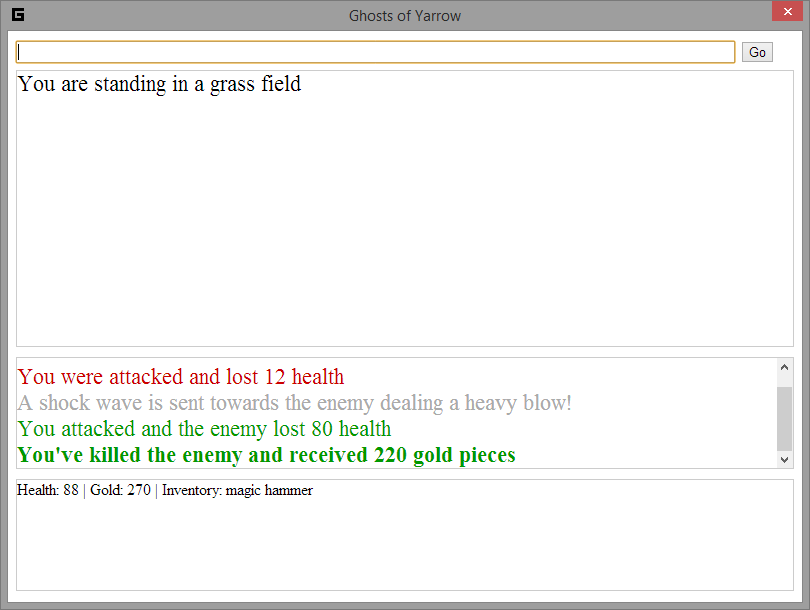

#The Ghosts of Yarrow

An exploration in creating a  hybrid text adventure / role playing game using Atom-Shell
and JavaScript.

##Status

The storyline, requirements and other details are being tracked in the notes directory
of this repository.

NOTE: This is some really horrible JavaScript so don't laugh, LOL!

If you were to run this what you'll get is more or less a demo with a tiny map. The real
story behind this game will be added later once I figure out how to code the various 
text adventure problems.

The map is only 3x3 and only serves as a placeholder.

To move type:

move east
move west
move south
move north

To pick up an item type:

get [item_name]

to engage the enemy in battle type:

use magic hammer

or

use wooden sword [if you've picked it up]

You really can't do anything else yet.

##Screenshot

</img>

##Author

Frank Hale &lt;frankhale@gmail.com&gt;  
Date: 8 July 2014

##License

GPL v3 - See LICENSE file